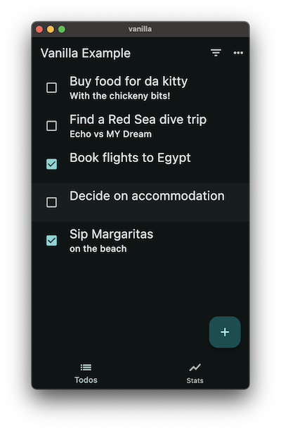
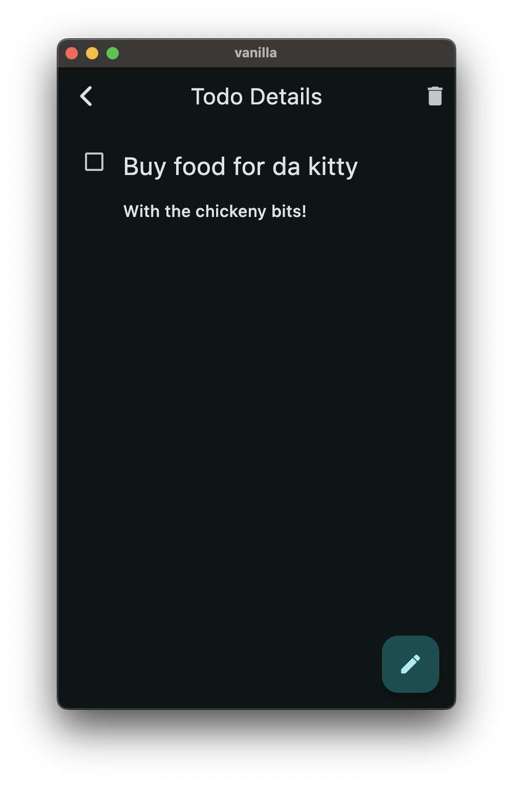
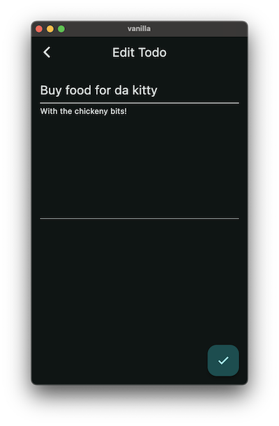
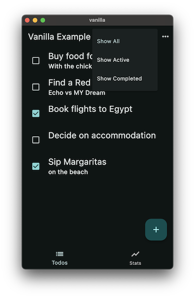
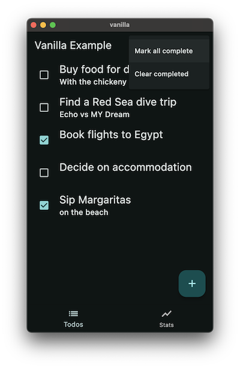
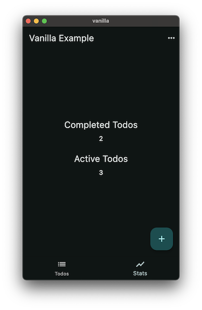

# Application Specification

We have created this short spec to help you create awesome and consistent todo apps. Make sure to not only read it but to understand it as well.

## Reference Application

The [vanilla](vanilla/) implementation should be used as the reference app and as a base when implementing a new todo app. Before implementing your own, we recommend that you interact with some of the other apps to see how they're built and how they behave. If something is unclear or could be improved, [let us know](https://github.com/brianegan/flutter_architecture_samples/issues).

Your app should look and behave exactly like the template and the other examples.

## README

All examples must include a README describing the general implementation, any frameworks used, and the build process if required. Please check the [vanilla](vanilla/) implementation for an example.

## Code

- Format your code with `dartfmt`
- Use the `.analysis_options.yaml` from the vanilla implementation and ensure there are no analysis errors
- Use the Theme and Widgets provided by the base package for the visual look, unless it makes sense to demonstrate an alternative practice.
- Your app should work on both Android and iOS 
- Your app should contain tests

## User Interface

### Home Screen

The home contains two Tabs: the List of Todos and Stats about the Todos.  

### List of Todos

  - Shows a loading screen until the Todos have been loaded from file storage or the web
  - Displays the list of Todos entered by the User
  - User can add a new todo by tapping the "+" button. This will take the user to a new Screen.
  - User can tap on each todo to Enter the Todo Details Screen
  - User can tap on the checkbox for each todo to mark it as complete / incomplete
  - User can delete any todo by swiping it away. When this happens, a SnackBar must be displayed with the Title of the Todo and a button to Undo this action. When the Undo button is clicked, the removed item should be appended to the end of the Todo List.
  - User can Filter the list of Todos using the Filter Icon in the top-right
  - User can Mark All todos completed or Clear all completed todos using the Overflow menu on the top right

### Add todo

  - The task is entered into the `TextField` at the top of the screen. The task `TextField` should be focused when the "Add New Todo" screen opens. In order to add a new todo, the task field must not be empty. Make sure to `.trim()` the input and then check that it's not empty before creating a new todo. If the task contains no text, show an error.  
  - A Note `TextField` must exist to store notes related to the todo.
  - Pressing the "+" button closes the "Add New Todo" screen and appends the new todo to the List of Todos.
  - Pressing the Back Button will close the screen without creating a new todo
  
### Todo Details Screen

  - User can see the Task and the complete text of the note.  
  - User can tap the Checkbox to mark the todo as complete / incomplete. This update must be reflected on the main Todos screen when the user navigates back.  
  - User can "Edit" the todo by tapping the "Edit" button. This will take the user to "Edit Screen".
  - User can Delete the Todo by tapping the Icon in the top-right of the screen. When the button is tapped, the details Screen should be closed and the user should be presented with the List of Todos. A SnackBar must be displayed with the Title of the Todo that was just removed and a button to Undo this action. When the Undo button is clicked, the removed item should be appended to the end of the Todo List.  

### Edit Todo Screen

  - The task is shown in an editable `TextField` at the top of the screen. The task `TextField` should NOT be focused when the "Edit New Todo" screen opens. In order to make changes to the todo, the task field must not be empty. Make sure to `.trim()` the input and then check that it's not empty before updating the todo. If the task contains no text, show an error.  
  - The note is shown in an editable `TextField` below the task.
  - Pressing the "✓" button closes the "Edit Todo Screen" and returns the User to the "Todo Details Screen." Any changes made in the Edit Screen should be reflected on the Details screen.
  - Pressing the Back button will close the screen without making changes to the todo.

### Filter Todos

  - User can filter to show All Todos (Active and Complete)
  - User can filter to show ONLY active todos
  - User can filter to show ONLY completed todos
  - Current Selection should be highlighted

### Overflow Menu

  - If all or some todos are incomplete, the "mark all" button should read "Mark all complete". When pressed, it should ensure all todos in the list are marked as complete. 
  - If all the todos are marked as complete, the "mark all" button should read "Mark all incomplete". When pressed, it should ensure all todos in the list are marked as incomplete.
  - User can Removes completed todos when clicked. Should be hidden when there are no completed todos. 

### Stats Screen

  - Shows the number of Completed todos
  - Shows the number of active todos
  - Filter Menu in the top right should be hidden on this tab
  - Using overflow menu to mark all as complete / incomplete or clear completed todos should cause the stats to update. 

## Data Sources

There are three levels of data persistence:

  - In-memory cache - Fast
  - Disk (File, SQLiteDb) - Slow
  - Network - Very slow (Mocked out)
  
Synchronization between layers is hard and depends on the case so it's out of the scope for the samples. The chosen sync implementation is very simple:

  - In every get operation:
    - Return in-memory cache if available, or
    - return info from disk
    - return info from network 
  - Every write/delete operation will simply:
    - Update cache
    - Update local
    - Update remote
    
Note that after the first request to the network, it's never hit again. In addition, in these examples, it's totally fine to use a Mock web service as a demonstration without the complication of setting up / talking to a real service.

## Testing

### Unit / Widget tests

Please include tests with your app! How easy it is to test an architecture is an important consideration when choosing which approach will work best for your project or team.

You do not need to write an exhaustive suite of Widget tests, but if the architecture lends itself to easy widget testing, please include a demonstration!

### Integration Tests

All samples should pass the integration test suite. Please see the `integration_tests` folder for more information, and check out the `test_driver` folder in an existing example as a reference.

## Routing

  - App must have 2 named routes: 
    - `/` - Takes you to the main tabs screen
    - `/addTodo` - Takes you to the add todo screen
    
To get to the Details and Edit screens, you can either use a named route or push a new Route directly with the Navigator.
