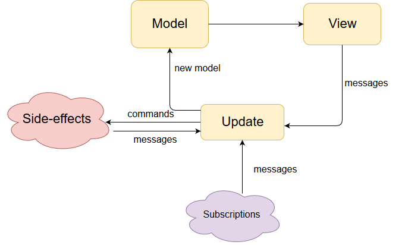

# MVU (Model-View-Update)

This sample makes use of the [dartea](https://pub.dartlang.org/packages/dartea) and [built_value](https://pub.dartlang.org/packages/built_value) libraries to manage state.


[dartea](https://pub.dartlang.org/packages/dartea) is implementation of enginge for MVU pattern inspired by [TEA (The Elm Architecture)](https://guide.elm-lang.org/architecture/) and [Elmish (F# TEA implemetation)](https://fable-elmish.github.io/elmish/)



## Components
* #### Model
    This is a snapshot of your application's state, defined as an immutable data structure using the [built_value](https://pub.dartlang.org/packages/built_value) library.
* #### Update
    This is a pure function that produces a new state of your application given the previous state and, optionally, new commands to process.
    ```dart
    Upd<TModel, TMsg> update(TMsg msg, TModel model)
    ```
    `Upd` is simple data-container, it contains properties `model → TModel` and `effects → Cmd<TMsg>` (side-effects)
* #### View
    This is a pure function that produces a new UI (Widget's tree) given the current state.
    ```dart
    Widget view<TModel, TMsg>(BuildContext ctx, Dispatch<TMsg> dispatch, TModel model)
    ```
    Dispatch is simple function `void dispatch(TMsg msg)` which is dispatched `messages` into program loop.
* #### Message
    This an event representing a change (delta) in the state of your application, originally defined as [Union type in Elm](https://guide.elm-lang.org/types/union_types.html) or [Discriminated union in F#](https://docs.microsoft.com/en-us/dotnet/fsharp/language-reference/discriminated-unions). Dart doesn't have built-in support for [Algebraic data types](https://en.wikipedia.org/wiki/Algebraic_data_type), so we can use simple inheritance instead.
* #### Command
    This is a carrier of instructions, that when evaluated may produce one or more messages. It's used for controlled side-effects.
* #### Subscriptions
    The events from the outside world, which are translated into messages. For example data from Websockets, timers and etc.

## Key concepts
The heart of the MVU application are three yellow boxes on the diagram. First, the state of the app (Model) is mapped to the widgets tree (View). Second, events from the UI are translated into Messages and goes to the Update function (together with current app state). Update function is the brain of the app. It contains all the presentation logic, and it MUST be [pure](https://en.wikipedia.org/wiki/Pure_function). All the side-effects (such as database queries, http requests and etc) must be isolated using Commands and Subscriptions.

### Code structure conventions
Every screen or component consists of `Model` and two main functions `update` and `view`. Optionally it may have `init` function, which creates initial state of a `Model`, and `subscription` function, which is subscribed to the events from the outside world and translates them to the `messages`.
For every screen we have thise files:
* ##### `state.dart`
    `update`, `init` and `subscribe` functions.
* ##### `types.dart` and `types.g.dart` (generated with `built_value`)
    `model`, `messages` and all the other classes which is required by `model`.
* ##### `view.dart`
    `view` function.
* ##### `xxx.dart`
    where `xxx` is screen or component name. It's composition (library) of all three parts above.


## Build
To enforcing `Model` immutability it need to be created with `built_value`. `built_value` library uses code generation. `built_value_generator` and `build_runner` are added as dev dependencies.
Whenever you update your Value Classes you need to run this command in console:
```
flutter packages pub run build_runner build
```
or run it in `watch` mode:
```
flutter packages pub run build_runner watch
```